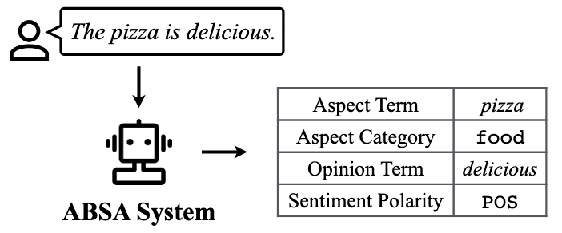

# CycleABSA: Cyclic Training for Aspect-Based Sentiment Analysis with Limited Supervision

## Overview

CycleABSA is an innovative framework for Aspect-Based Sentiment Analysis (ABSA) that leverages a cyclic training approach to improve performance under limited supervision. It introduces two complementary models:
- **Text-to-Aspects (T2A):** Extracts aspect tuples from text.
- **Aspects-to-Text (A2T):** Reconstructs the original text from aspect annotations.
These models are trained alternately, allowing one model to generate supervised data for the other, reducing the reliance on large annotated datasets.

## 🧩 **Problem Formulation**


Aspect-Based Sentiment Analysis (ABSA) aims to identify and categorize sentiments expressed towards specific aspects within a text. To formalize the problem, we define the following sets:
### Sets
- **Text:** $\mathcal{T} = \{T | T = (t_1, t_2, \dots, t_{|T|})\}$ represents the set of all input texts.
- **Aspect term:** $\mathcal{A} = \{a | a = (a_1, a_2, \dots, a_{|a|})\}$ denotes the set of aspect terms.
- **Aspect category:** $\mathcal{C} = \{c | c = (c_1, c_2, \dots, c_{|c|})\}$ represents categories under which aspects can be grouped.
- **Opinion term:** $\mathcal{O} = \{o | o = (o_1, o_2, \dots, o_{|o|})\}$ refers to opinion expressions related to aspects.
- **Sentiment polarity:** $\mathcal{S} = \{POS, NEG, NEUT\}$ indicates the sentiment polarity (positive, negative, neutral).
- **Aspect tuple:** $\mathcal{E}$ represents task-dependent tuples combining the above elements.
- **Aspect annotations:** $A = \{A_1, A_2, \cdots \} \in \mathcal{P}(\mathcal{E})$

### ABSA Tasks

| Task                                | Output       |
| ----------------------------------- | ------------ |
| Aspect Sentiment Quad Prediction    | {a, c, o, p} |
| Aspect-Category-Sentiment Detection | {a, c, p}    |
| Aspect Sentiment Triplet Extraction | {a, o, p}    |
| Aspect-Opinion Pair Extraction      | {a, o}       |
| End-to-End ABSA                     | {a, p}       |
| Aspect Category Sentiment Analysis  | {c, p}       |

CycleABSA framework supports multiple tasks based on different combinations of aspect-related elements:  
* **Quad**
	* ASQP/ACOS: Aspect Sentiment Quad Prediction
		* $\mathcal{E}_{ACOP} = \mathcal{A} \times \mathcal{C} \times \mathcal{O} \times \mathcal{S}$ 
		* $A_j = \big(\text{a}_j, \text{c}_j, \text{o}_j, \text{p}_j\big)$
* **Triplet**
	* ACSD: Aspect-Category-Sentiment Detection
		* $\mathcal{E}_{ACS} = \mathcal{A} \times \mathcal{C} \times \mathcal{S}$ 
		* $A_j = \big(\text{a}_j, \text{c}_j, \text{p}_j\big)$
	* ASTE: Aspect Sentiment Triplet Extraction
		* $\mathcal{E}_{AOP} = \mathcal{A} \times \mathcal{O} \times \mathcal{S}$ 
		* $A_j = \big(\text{a}_j, \text{o}_j, \text{p}_j\big)$
* **Pair**
	* AOPE: Aspect-Opinion Pair Extraction
		* $\mathcal{E}_{AO} = \mathcal{A} \times \mathcal{O}$ 
		* $A_j = \big(\text{a}_j, \text{o}_j\big)$
	* ABSA: End-to-End ABSA
		* $\mathcal{E}_{AP} = \mathcal{A} \times \mathcal{S}$
		* $A_j = \big(\text{a}_j, \text{p}_j\big)$
	* ACSA: Aspect Category Sentiment Analysis
		* $\mathcal{E}_{CP} = \mathcal{C} \times \mathcal{S}$ 
		* $A_j = \big(\text{c}_j, \text{p}_j\big)$

### Functions
The framework is structured around two primary functions:
- **T2A (Text-to-Aspects):** Maps text to a set of aspect tuples: $\mathcal{T} \rightarrow \mathcal{P}(\mathcal{E})$
- **A2T (Aspects-to-Text):** Reconstructs text from aspect tuples: $\mathcal{P}(\mathcal{E}) \rightarrow \mathcal{T}$

## 🔍 **CycleABSA Methodology**
CycleABSA operates on a cyclic training mechanism that alternates between two models — Text-to-Aspects (T2A) and Aspects-to-Text (A2T) — to iteratively improve performance.
### CycleABSA Framework  
The framework consists of the following key components:

**Sets and Datasets:**
- $\mathcal{T}$: Set of texts
- $\mathcal{E}$: Set of aspect tuples (task-dependent)
- $\mathcal{D}_{T}$: Dataset containing texts
- $\mathcal{D}_{A}$: Dataset containing aspect tuples
-  $\mathcal{D}_{\text{pair}}$: Parallel dataset (low-ressource)

**Functions:**
- **T2A:** $\mathcal{T} \rightarrow \mathcal{P}(\mathcal{E})$ — Extracts aspects from text, parameterized by $\theta$.
- **A2T:** $\mathcal{P}(\mathcal{E}) \rightarrow \mathcal{T}$ — Generates text from aspect tuples, parameterized by $\phi$.
- These functions are inverses of each other: $\text{T2A}^{-1} = \text{A2T}$ and $\text{A2T}^{-1} = \text{T2A}$.
### Cycle Training Process


1. **T-Cycle:**
	- **Generation Step:** For each $T \in \mathcal{D}_T$, generate $A^{'} = \text{T2A}(T)$.
	- **Training Step:** Train A2T on $(T, A^{'})$, reconstructing $T^{'} = \text{A2T}(A^{'})$.
	- **Loss Function:** $\mathcal{L}_{\phi}(T, T')$ measures reconstruction loss.
2. **A-Cycle:**
	- **Generation Step:** For each $A \in \mathcal{D}_A$, generate $T^{'} = \text{A2T}(A)$.
	- **Training Step:** Train T2A on $(T^{'}, A)$, reconstructing $A^{'} = \text{T2A}(T^{'})$.
	- **Loss Function:** $\mathcal{L}_{\theta}(A, A')$ measures extraction loss.
### Low-Resource Setting


In low-resource scenarios, CycleABSA leverages semi-supervised learning:
- **Step 1:** Supervised pre-training of T2A on parallel dataset $\mathcal{D}_{\text{pair}}$.
- **Step 2:** Supervised pre-training of A2T on $\mathcal{D}_{\text{pair}}$.
- **Step 3:** Cyclic training using unlabeled data from $\mathcal{D}_T$ and $\mathcal{D}_A$.

## 📈 **Evaluation Metrics**
To comprehensively assess the performance of both models, we employ a combination of traditional and advanced metrics:
### For Text-to-Aspects (T2A):
- **Precision (P):** Measures the proportion of correctly identified aspects among all predicted aspects.
- **Recall (R):** Measures the proportion of correctly identified aspects among all actual aspects.
- **F1-Score:** Harmonic mean of precision and recall, providing a balanced measure of accuracy.
### For Aspects-to-Text (A2T):
- **BLEU:** Evaluates the overlap of n-grams between generated and reference texts.
- **METEOR:** Considers synonymy and semantic similarity for better correlation with human judgment.
- **ROUGE (ROUGE-1, ROUGE-2, ROUGE-L):** Measures the overlap of unigrams, bigrams, and longest common subsequences.
- **BERT-F1:** Utilizes contextual embeddings to capture semantic similarity beyond surface-level token matching.

By combining these metrics, we ensure robust evaluation across both extraction and generation tasks.
## 🚀 **Project Structure**
```
cycle_absa/
├── __pycache__/
├── cycle_absa.py # Main training and model management script
├── enums.py # Enum definitions for task and model configurations
├── full_supervised.py # Baseline implementation for fully supervised learning
├── prompts.py # Prompt templates for T2A and A2T tasks
├── utils.py # Utility functions
├── annotations_text.py # Handling text and annotations
├── data.py # Data loading and preprocessing
├── eval.py # Evaluation metrics and methods
└── scripts/ # Scripts for training, evaluation, and data processing
```

## ⚙️ **Installation**  
**Clone the repository:**
```bash
git clone https://github.com/BenKabongo25/cycle_absa.git
cd cycle_absa
```

## 📚 **Usage**

### 1️⃣ **Train a Model (CycleABSA Example)**

```bash
python3 cycle_absa.py \
--model_name_or_path t5-base \
--tokenizer_name_or_path t5-base \
--max_input_length 32 \
--max_target_length 32 \
--task_type T2A \
--absa_tuple acop \
--annotations_text_type gas_extraction_style \
--text_column text \
--annotations_column annotations \
--annotations_raw_format acpo \
--annotation_flag \
--train_path /home/b.kabongo/datasets/Restaurant/train.csv \
--eval_path /home/b.kabongo/datasets/Restaurant/eval.csv \
--test_path /home/b.kabongo/datasets/Restaurant/test.csv \
--exp_dir /home/b.kabongo/exps/cycle_absa/Restaurant/cycle_absa_acop/t5_base \
--train_size 0.8 \
--train_labeled_size 0 \
--val_size 0.1 \
--test_size 0.1 \
--random_state 42 \
--n_labeled_epochs 0 \
--n_unlabeled_epochs 50 \
--batch_size 8 \
--lr 0.001
```

### 2️⃣ **Run Full Supervised Baseline**

```bash
python3 full_supervised.py \
--model_name_or_path t5-base \
--tokenizer_name_or_path t5-base \
--max_input_length 32 \
--max_target_length 32 \
--task_type T2A \
--absa_tuple acop \
--annotations_text_type gas_extraction_style \
--text_column text \
--annotations_column annotations \
--annotations_raw_format acpo \
--annotation_flag \
--train_path /home/b.kabongo/datasets/Laptop/train.csv \
--eval_path /home/b.kabongo/datasets/Laptop/eval.csv \
--test_path /home/b.kabongo/datasets/Laptop/test.csv \
--exp_dir /home/b.kabongo/exps/cycle_absa/Laptop/full_supervised_a2t_acop/t5_base \
--train_size 0.8 \
--val_size 0.1 \
--test_size 0.1 \
--n_epochs 50 \
--batch_size 4 \
--lr 0.001
```

## 🤝 **Contributing**
1. Fork the repository.
2. Create your feature branch (`git checkout -b feature-xyz`).
3. Commit your changes (`git commit -m 'Add new feature'`).
4. Push to the branch (`git push origin feature-xyz`).
5. Open a pull request.

## 📜 **License**
This project is licensed under the MIT License.

## 📬 **Contact**
For any questions or suggestions, please contact [kabongo.ben025@gmail.com].